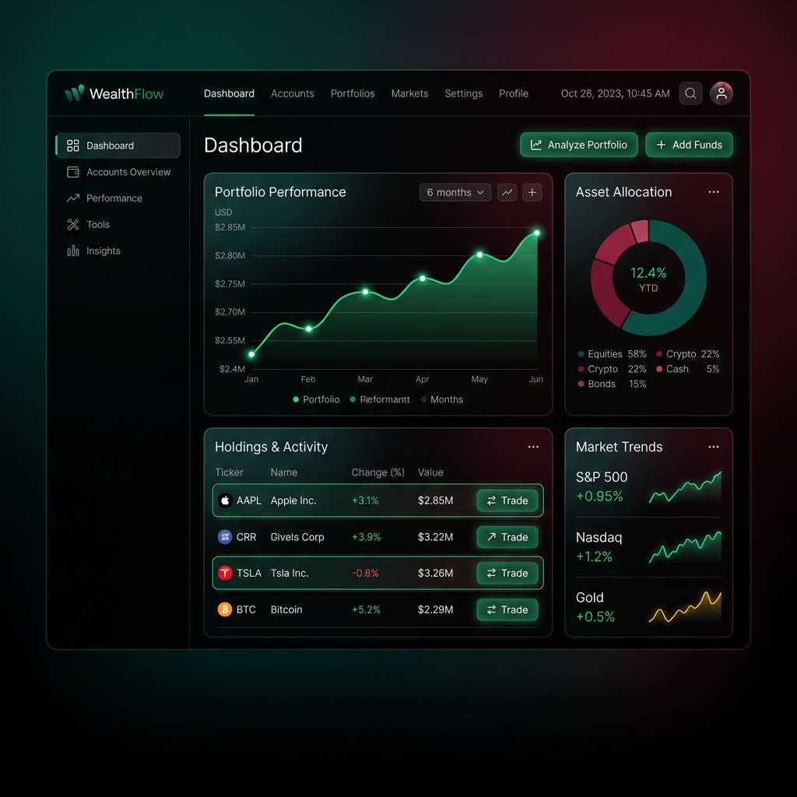

<div align="center">
  
  
  
  
</div>

<br />

<div align="center">
  
</div>

# AI Finance Controller

A premium, AI-powered financial reconciliation dashboard designed to automate the mapping of internal financial ledgers with external payment gateways like Razorpay. It features a cutting-edge glassmorphism UI with a high-contrast dark theme, combining powerful Python backend analytics with an immersive frontend experience.

## ✨ Detailed Features

### 1. Automated Financial Reconciliation Engine
At the core of the AI Finance Controller is a robust, automated reconciliation engine. It takes complex financial data—such as internal company ledgers and external bank/gateway statements—and maps them together mathematically. 
- **Fuzzy Matching:** Automatically handles slight mismatches in names, transaction times, or reference numbers.
- **Discrepancy Detection:** Flags exact mismatches, duplicate entries, or missing transactions that could signify dropped payments or double billing.
- **Real-Time KPI Generation:** Calculates exact metrics like "Auto Reconciled," "Sent to Human Review," and "Cost of False Positives" instantly.

### 2. Intelligent AI QA Agent
Instead of manually hunting through spreadsheets to figure out why reconciliation failed, the dashboard features an embedded **AI Quality Assurance Agent**. 
- **Context-Aware Analytics:** Ask the AI questions like, *"Why were 12 transactions sent to human review?"* or *"What is the primary cause of unresolved payments this week?"*
- **Suggested Queries:** The dashboard automatically generates contextual "Suggested Questions" based on the current financial data loaded in the system, helping you uncover hidden anomalies effortlessly.

### 3. Razorpay Gateway Integration
The system is built to ingest real-time external data to keep reconciliation fully up-to-date.
- **Secure API Connectivity:** Directly pulls active transaction data, settlements, and payment statuses from Razorpay.
- **Dynamic Ledger Updating:** Automatically normalizes the Razorpay payload into a standard schema so it can be seamlessly checked against your internal records.

### 4. Synthetic Data Generation Engine
To test and validate the reconciliation accuracy without risking sensitive production data, the application includes a synthetic data generator.
- **Simulated Real-World Errors:** Generates fake internal ledgers and bank statements that purposefully include realistic errors (e.g., typos in names, missing reference IDs, timezone shifts in timestamps).
- **Stress Testing:** Allows developers to benchmark the reconciliation engine's logic against thousands of edge-case scenarios on the fly.

### 5. Dynamic Port Configuration & Global Access
Built for collaborative remote teams and developer flexibility.
- **Custom Ports:** Launch the dashboard on any port dynamically via command line arguments (e.g., `python app.py 5005`). No hardcoded ports to worry about.
- **Global Tunnels:** Fully compatible with tools like `localtunnel`, allowing you to safely expose your local financial dashboard to stakeholders or mentors across the globe via a secure URL.

## 🚀 Quick Start

### 1. Prerequisites
- Python 3.8+
- Node.js (optional, for running localtunnel)

### 2. Installation
Clone the repository and install the required dependencies:

```bash
git clone https://github.com/Shikhar28-web/ai-finance-controller.git
cd ai-finance-controller
pip install -r requirements.txt
```

### 3. Running the Server
You can start the server on the default port (`5000`), or specify a custom port:

```bash
# Run on default port (5000)
python app.py

# Run on a custom port (e.g., 5005)
python app.py 5005
```

### 4. Exposing Globally (For Remote Mentors / Testing)
If you need to share the live dashboard securely across the internet, you can tunnel the local port:

```bash
# Using Localtunnel (Recommended)
npx localtunnel --port 5005
```
*Note: Localtunnel will provide a public URL. The "Tunnel Password" is your public IP address, which you can find at [api.ipify.org](https://api.ipify.org).*

## 🧠 Architecture

- **Backend**: Flask (Python) handles the API routing, data synthetic generation, and AI agent logic.
- **Frontend**: Pure Vanilla HTML/CSS/JS ensuring lightning-fast load times. The UI uses heavy custom CSS variables for easy theming without the overhead of external libraries.
- **Data Layer**: Processes `.csv` statements and dynamically updates `metrics_summary.json` for persistent visual charting.

## 📄 License

This project is open-source and available under the MIT License.
